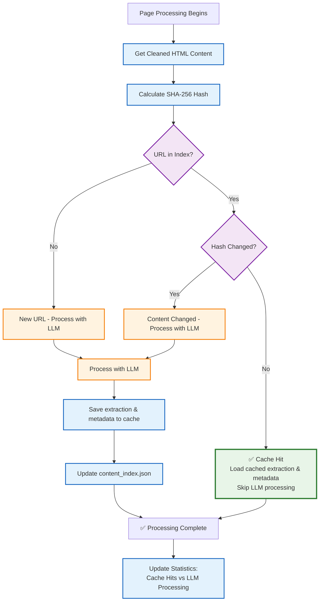

# Content-Based Deduplication Architecture
*Generated: 2025-05-26*

## Deduplication System Overview

```mermaid
flowchart TD
    subgraph "Always-On Deduplication System"
        subgraph "Content Analysis"
            URL[Page URL]
            HTML[Cleaned HTML Content]
            HASH[SHA-256 Content Hash]
        end
        
        subgraph "Cache Management"
            INDEX[content_index.json<br/>URL → Hash Mapping]
            EXTRACT[extractions/{hash}.json<br/>Cached LLM Results]
            META[metadata/{hash}_meta.json<br/>Page Metadata]
        end
        
        subgraph "Decision Logic"
            CHECK{Content Hash<br/>Changed?}
            CACHE_HIT[Use Cached Result<br/>No LLM Call]
            CACHE_MISS[Process with LLM<br/>Update Cache]
        end
    end
    
    URL --> HASH
    HTML --> HASH
    HASH --> INDEX
    INDEX --> CHECK
    
    CHECK -->|Hash Unchanged| CACHE_HIT
    CHECK -->|Hash Changed/New| CACHE_MISS
    
    CACHE_HIT --> EXTRACT
    CACHE_HIT --> META
    
    CACHE_MISS --> LLM[LLM Processing]
    LLM --> UPDATE[Update Cache Files]
    UPDATE --> EXTRACT
    UPDATE --> META
    UPDATE --> INDEX
    
    %% Styling
    classDef cache fill:#e8f5e8,stroke:#1b5e20,stroke-width:2px
    classDef decision fill:#fff3e0,stroke:#ef6c00,stroke-width:2px
    classDef process fill:#e3f2fd,stroke:#1565c0,stroke-width:2px
    classDef hit fill:#e8f5e8,stroke:#2e7d32,stroke-width:3px
    classDef miss fill:#ffebee,stroke:#c62828,stroke-width:2px
    
    class INDEX,EXTRACT,META cache
    class CHECK decision
    class HASH,LLM,UPDATE process
    class CACHE_HIT hit
    class CACHE_MISS miss
```

## ContentIndexManager Class Architecture

```mermaid
classDiagram
    class ContentIndexManager {
        +str base_dir
        +str index_file
        +dict url_index
        +__init__(base_dir="extracted-docs")
        +should_process_with_llm(url, content) Tuple~bool, str~
        +calculate_content_hash(content) str
        +get_cached_extraction(url) Dict
        +get_cached_metadata(url) Dict
        +update_url_record(url, hash, extraction, metadata)
        +get_cache_stats() Dict
        +cleanup_stale_entries() int
        -_load_index()
        -_save_index()
        -_get_url_hash(url) str
        -_get_extraction_path(content_hash) str
        -_get_metadata_path(content_hash) str
    }
    
    class FileSystem {
        <<external>>
        +extracted-docs/content_index.json
        +extracted-docs/extractions/{hash}.json
        +extracted-docs/metadata/{hash}_meta.json
    }
    
    ContentIndexManager --> FileSystem : manages
```

## Deduplication Decision Flow



## Cache File Structure

```mermaid
graph TD
    subgraph "extracted-docs/ Directory"
        INDEX_FILE[content_index.json<br/>Main URL-to-hash mapping]
        
        subgraph "extractions/ Directory"
            EXT1[{hash1}.json<br/>LLM extraction results]
            EXT2[{hash2}.json<br/>LLM extraction results]
            EXT3[{hash3}.json<br/>LLM extraction results]
        end
        
        subgraph "metadata/ Directory"
            META1[{hash1}_meta.json<br/>Page metadata & timestamps]
            META2[{hash2}_meta.json<br/>Page metadata & timestamps]
            META3[{hash3}_meta.json<br/>Page metadata & timestamps]
        end
    end
    
    INDEX_FILE -.-> EXT1
    INDEX_FILE -.-> EXT2
    INDEX_FILE -.-> EXT3
    
    EXT1 -.-> META1
    EXT2 -.-> META2
    EXT3 -.-> META3
```

## Performance Benefits

### Cost Optimization
- **Eliminates Redundant LLM Calls**: Content unchanged = no API cost
- **Intelligent Change Detection**: Only processes when content actually changes
- **Automatic Optimization**: No user configuration required

### Performance Improvements
- **Faster Processing**: Cache hits return results instantly
- **Reduced Network Usage**: No unnecessary API calls to LLM providers
- **Scalable Architecture**: Cache grows with usage, improving efficiency over time

### User Experience
- **Transparent Operation**: Users see clear cache hit/miss statistics
- **Consistent Results**: Cached results identical to fresh processing
- **No Configuration**: Works automatically without user intervention

## Cache Management Features

### Statistics Tracking
```json
{
  "total_urls": 150,
  "extraction_files": 89,
  "metadata_files": 89,
  "index_file_exists": true,
  "base_directory": "extracted-docs",
  "deduplication_enabled": true
}
```

### Cleanup Operations
- **Stale Entry Detection**: Identifies orphaned cache files
- **Automatic Cleanup**: Removes entries without corresponding files
- **Storage Optimization**: Maintains cache efficiency over time

## Integration with ApiDocCrawler

### Always-Enabled Architecture
- **No Conditional Logic**: Deduplication always active
- **Simplified Code**: Removed all `enable_deduplication` checks
- **Consistent Behavior**: Every crawl benefits from optimization

### Seamless Integration
- **Transparent to Users**: Works behind the scenes
- **Preserved Functionality**: All existing features work unchanged
- **Enhanced Output**: Results include cache metadata and statistics

## Migration Impact

### Breaking Changes Removed
- **No --disable-deduplication Flag**: Option completely removed
- **No enable_deduplication Parameter**: Constructor simplified
- **Always Optimized**: No way to disable the optimization

### Benefits for All Users
- **Cost Savings**: Automatic for all crawling operations
- **Performance**: Faster processing on repeated crawls
- **Simplicity**: No decisions needed about when to enable