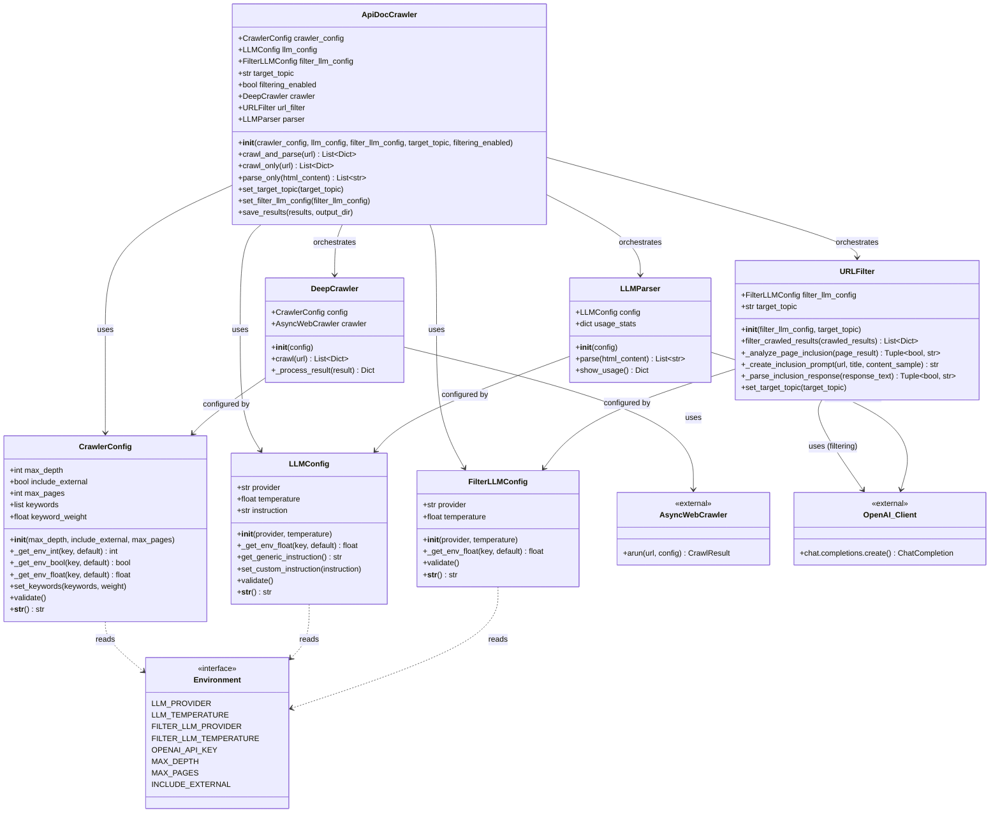
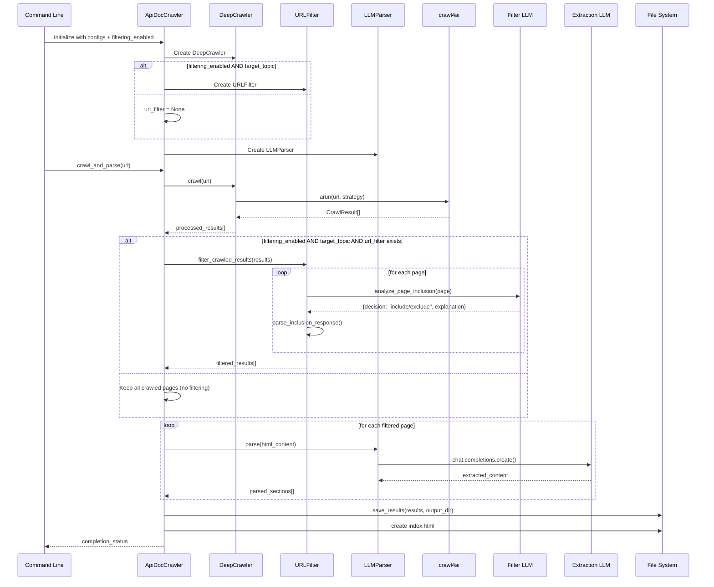
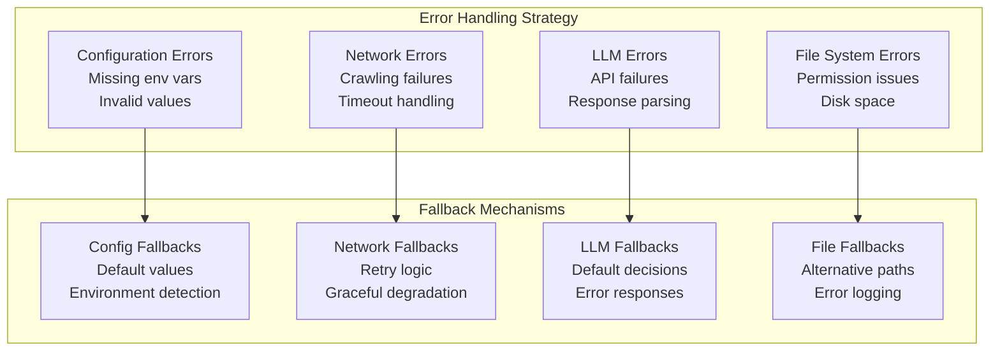

# API Documentation Crawler - Detailed Technical Architecture
*Generated: 2025-05-25*

## Detailed Class and Component Diagram



## Detailed Process Flow Diagram



## LLM Integration Details

```mermaid
flowchart TD
    subgraph "Dual-Model LLM Architecture"
        subgraph "Filter Model (Fast & Cheap)"
            FM[Filter LLM<br/>gpt-3.5-turbo / o1-mini]
            FP[Binary Decision Prompt<br/>Include/Exclude + Explanation]
            FR[JSON Response<br/>{decision, explanation}]
        end
        
        subgraph "Extraction Model (Premium)"
            EM[Extraction LLM<br/>gpt-4o / o1-preview]
            EP[Content Extraction Prompt<br/>Generic API Documentation]
            ER[Structured Content<br/>Markdown Sections]
        end
    end
    
    subgraph "Model Compatibility"
        O1[o1 Model Detection<br/>No system messages<br/>No temperature/max_tokens]
        STD[Standard Models<br/>System + User messages<br/>Full parameter support]
    end
    
    %% Flow
    URLFilter --> FM
    FM --> FP
    FP --> FR
    
    LLMParser --> EM
    EM --> EP
    EP --> ER
    
    FM -.-> O1
    EM -.-> O1
    FM -.-> STD
    EM -.-> STD
```

## Configuration and Environment Flow

```mermaid
flowchart LR
    subgraph "Environment Variables"
        ENV1[LLM_PROVIDER<br/>LLM_TEMPERATURE]
        ENV2[FILTER_LLM_PROVIDER<br/>FILTER_LLM_TEMPERATURE]
        ENV3[MAX_DEPTH<br/>MAX_PAGES<br/>INCLUDE_EXTERNAL]
        ENV4[OPENAI_API_KEY]
    end
    
    subgraph "Configuration Classes"
        LC[LLMConfig<br/>Extraction Model]
        FC[FilterLLMConfig<br/>Filter Model]
        CC[CrawlerConfig<br/>Crawl Parameters]
    end
    
    subgraph "Validation & Defaults"
        VAL[validate()<br/>Environment checks<br/>Default values<br/>Error handling]
    end
    
    ENV1 --> LC
    ENV2 --> FC
    ENV3 --> CC
    ENV4 --> LC
    ENV4 --> FC
    
    LC --> VAL
    FC --> VAL
    CC --> VAL
    
    VAL --> ApiDocCrawler
```

## Error Handling and Fallbacks



## Key Technical Features

### Filtering Opt-In Enhancement (2025-05-26)
- **Explicit Control**: Filtering now requires both `--enable-filtering` flag and `--target-topic`
- **Performance Optimization**: No LLM calls when filtering disabled (default behavior)
- **Cost Management**: Filter LLM API usage only when explicitly requested
- **Clear Intent**: Users must explicitly opt-in to filtering behavior

### Binary Filtering Enhancement (2025-05-25)
- **Simplified Decision Making**: Replaced 0.0-1.0 scoring with include/exclude
- **Eliminated Thresholds**: No more arbitrary cutoff configuration
- **Maintained Transparency**: Decision explanations preserved
- **Improved UX**: More intuitive binary decisions

### Dual-Model Architecture Benefits
- **Cost Optimization**: Cheap models for filtering, premium for extraction
- **Performance**: Fast relevance decisions with appropriate models
- **Quality**: High-quality extraction with capable models
- **Flexibility**: Independent scaling and configuration

### Async Processing Patterns
- **Concurrent Crawling**: Multiple pages processed simultaneously
- **Non-blocking LLM Calls**: Async API interactions
- **Resource Management**: Proper cleanup and connection handling