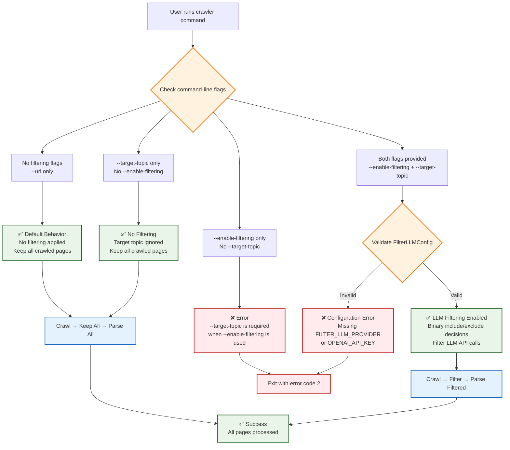
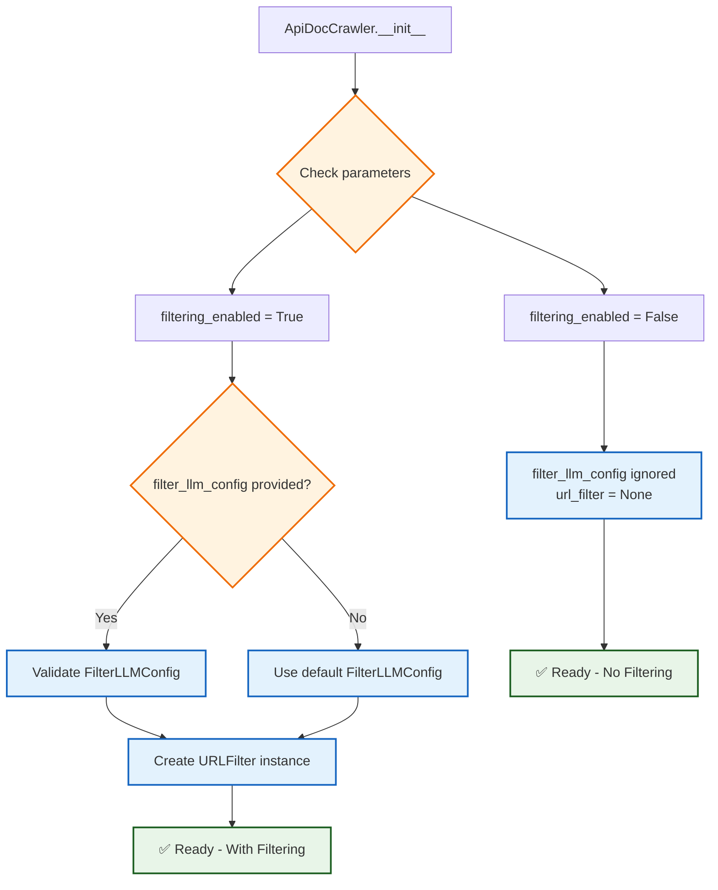

# Filtering Opt-In Decision Flow
*Generated: 2025-05-26*

## Command-Line Filtering Decision Flow



## ApiDocCrawler Initialization Flow



## Filtering Logic During Crawl

```mermaid
flowchart TD
    CRAWL_COMPLETE[Crawling completed<br/>Found N pages] --> CHECK_FILTER{filtering_enabled?}
    
    CHECK_FILTER -->|False| SKIP_FILTER[Skip filtering<br/>Log: "Filtering disabled - keeping all crawled pages"]
    CHECK_FILTER -->|True| CHECK_COMPONENTS{url_filter exists?<br/>target_topic set?}
    
    CHECK_COMPONENTS -->|No| SKIP_FILTER
    CHECK_COMPONENTS -->|Yes| APPLY_FILTER[Apply LLM filtering<br/>Log: "Filtering for inclusion based on: {topic}"]
    
    SKIP_FILTER --> ALL_PAGES[Keep all N pages<br/>No LLM API calls]
    
    APPLY_FILTER --> FILTER_LOOP[For each page:<br/>LLM binary decision<br/>Include/Exclude + Explanation]
    
    FILTER_LOOP --> FILTERED_PAGES[Keep M pages (M ≤ N)<br/>Log: "Filtered results: M/N pages kept"]
    
    ALL_PAGES --> PARSE_ALL[Parse all N pages]
    FILTERED_PAGES --> PARSE_FILTERED[Parse M filtered pages]
    
    PARSE_ALL --> RESULT_NO_FILTER[Results with no filtering metadata<br/>Log: "No filtering applied - all crawled pages were kept"]
    PARSE_FILTERED --> RESULT_WITH_FILTER[Results with filtering metadata<br/>included: true/false<br/>decision_explanation: "..."]
    
    %% Styling
    classDef nofilter fill:#e8f5e8,stroke:#1b5e20,stroke-width:2px
    classDef filtered fill:#e3f2fd,stroke:#1565c0,stroke-width:2px
    classDef decision fill:#fff3e0,stroke:#ef6c00,stroke-width:2px
    classDef process fill:#f3e5f5,stroke:#4a148c,stroke-width:2px
    
    class SKIP_FILTER,ALL_PAGES,PARSE_ALL,RESULT_NO_FILTER nofilter
    class APPLY_FILTER,FILTER_LOOP,FILTERED_PAGES,PARSE_FILTERED,RESULT_WITH_FILTER filtered
    class CHECK_FILTER,CHECK_COMPONENTS decision
    class CRAWL_COMPLETE process
```

## Key Benefits of Opt-In Design

### Performance Benefits
- **Default Fast Path**: No LLM filtering calls when not explicitly requested
- **Reduced Latency**: Faster crawling for users who want everything
- **Resource Efficiency**: No unnecessary API calls or processing

### Cost Benefits
- **Predictable Costs**: Filter LLM usage only when explicitly enabled
- **User Control**: Clear opt-in prevents surprise API charges
- **Budget Management**: Users can choose when to incur filtering costs

### User Experience Benefits
- **Explicit Intent**: Clear command-line flags show filtering intention
- **Error Prevention**: Validation prevents incomplete flag combinations
- **Backward Compatibility**: Existing usage patterns continue to work

### Technical Benefits
- **Clean Architecture**: Conditional initialization based on explicit flags
- **Maintainability**: Clear separation between filtered and non-filtered paths
- **Testability**: Easy to test both filtering enabled and disabled scenarios

## Migration Guide

### Before (Automatic Filtering)
```bash
# This would automatically enable filtering
python -m src.main https://docs.example.com --target-topic "Python SDK"
```

### After (Explicit Opt-In)
```bash
# This now keeps all pages (no filtering)
python -m src.main https://docs.example.com --target-topic "Python SDK"

# This enables filtering (explicit opt-in)
python -m src.main https://docs.example.com --enable-filtering --target-topic "Python SDK"
```

### Breaking Change Notice
Users who previously relied on automatic filtering when `--target-topic` was provided will need to add the `--enable-filtering` flag to maintain the same behavior.