# API Documentation Crawler - System Overview
*Generated: 2025-05-25*

## High-Level Architecture Diagram

```mermaid
flowchart TD
    %% User Interface Layer
    CLI[Command Line Interface<br/>--url, --target-topic, --max-depth, etc.]
    
    %% Core System Components
    subgraph "Core System"
        ORCH[ApiDocCrawler<br/>🎯 Main Orchestrator]
        CRAWLER[DeepCrawler<br/>🕷️ Web Crawling]
        FILTER[URLFilter<br/>🔍 Binary Filtering]
        PARSER[LLMParser<br/>📝 Content Extraction]
    end
    
    %% Configuration Layer
    subgraph "Configuration"
        CC[CrawlerConfig<br/>📋 Crawl Settings]
        LC[LLMConfig<br/>🤖 Extraction Model]
        FC[FilterLLMConfig<br/>🎯 Filter Model]
    end
    
    %% External Dependencies
    subgraph "External Services"
        CRAWL4AI[crawl4ai Library<br/>🌐 Web Scraping]
        FILTER_LLM[Filter LLM<br/>⚡ Fast Model<br/>gpt-3.5-turbo]
        EXTRACT_LLM[Extraction LLM<br/>🧠 Premium Model<br/>gpt-4o]
    end
    
    %% Data Flow
    CLI --> CC
    CLI --> LC
    CLI --> FC
    CLI --> ORCH
    
    ORCH --> CRAWLER
    ORCH --> FILTER
    ORCH --> PARSER
    
    CRAWLER --> CRAWL4AI
    FILTER --> FILTER_LLM
    PARSER --> EXTRACT_LLM
    
    %% Process Flow
    subgraph "Data Processing Pipeline"
        INPUT[📥 Target URL]
        CRAWL_RESULTS[🕸️ Crawled Pages]
        FILTERED_RESULTS[✅ Relevant Pages]
        PARSED_CONTENT[📄 Extracted Content]
        OUTPUT[💾 Saved Results]
    end
    
    INPUT --> CRAWLER
    CRAWLER --> CRAWL_RESULTS
    CRAWL_RESULTS --> FILTER
    FILTER --> FILTERED_RESULTS
    FILTERED_RESULTS --> PARSER
    PARSER --> PARSED_CONTENT
    PARSED_CONTENT --> OUTPUT
    
    %% Key Features Callouts
    subgraph "Key Features"
        DUAL[🔄 Dual-Model Architecture<br/>Separate models for filtering & extraction]
        BINARY[⚡ Binary Filtering<br/>Include/Exclude decisions]
        MODULAR[🧩 Modular Design<br/>Loosely coupled components]
        ASYNC[⚡ Async Processing<br/>Concurrent operations]
    end
    
    %% Styling
    classDef coreComponent fill:#e1f5fe,stroke:#01579b,stroke-width:2px
    classDef config fill:#f3e5f5,stroke:#4a148c,stroke-width:2px
    classDef external fill:#e8f5e8,stroke:#1b5e20,stroke-width:2px
    classDef data fill:#fff3e0,stroke:#e65100,stroke-width:2px
    classDef feature fill:#fce4ec,stroke:#880e4f,stroke-width:2px
    
    class ORCH,CRAWLER,FILTER,PARSER coreComponent
    class CC,LC,FC config
    class CRAWL4AI,FILTER_LLM,EXTRACT_LLM external
    class INPUT,CRAWL_RESULTS,FILTERED_RESULTS,PARSED_CONTENT,OUTPUT data
    class DUAL,BINARY,MODULAR,ASYNC feature
```

## System Flow Summary

1. **Input**: User provides target URL and optional filtering topic via CLI
2. **Configuration**: System initializes crawler, LLM, and filter configurations
3. **Crawling**: DeepCrawler uses crawl4ai to discover and fetch pages
4. **Binary Filtering**: URLFilter uses fast LLM to make include/exclude decisions
5. **Content Extraction**: LLMParser uses premium LLM to extract structured content
6. **Output**: Results saved to filesystem with metadata and explanations

## Key Architectural Decisions

- **Dual-Model LLM Architecture**: Separate optimized models for different tasks
- **Binary Filtering**: Simplified from scoring to include/exclude decisions
- **Modular Design**: Loosely coupled components for maintainability
- **Async Processing**: Concurrent operations for performance
- **Configuration-Driven**: Environment-based setup with validation