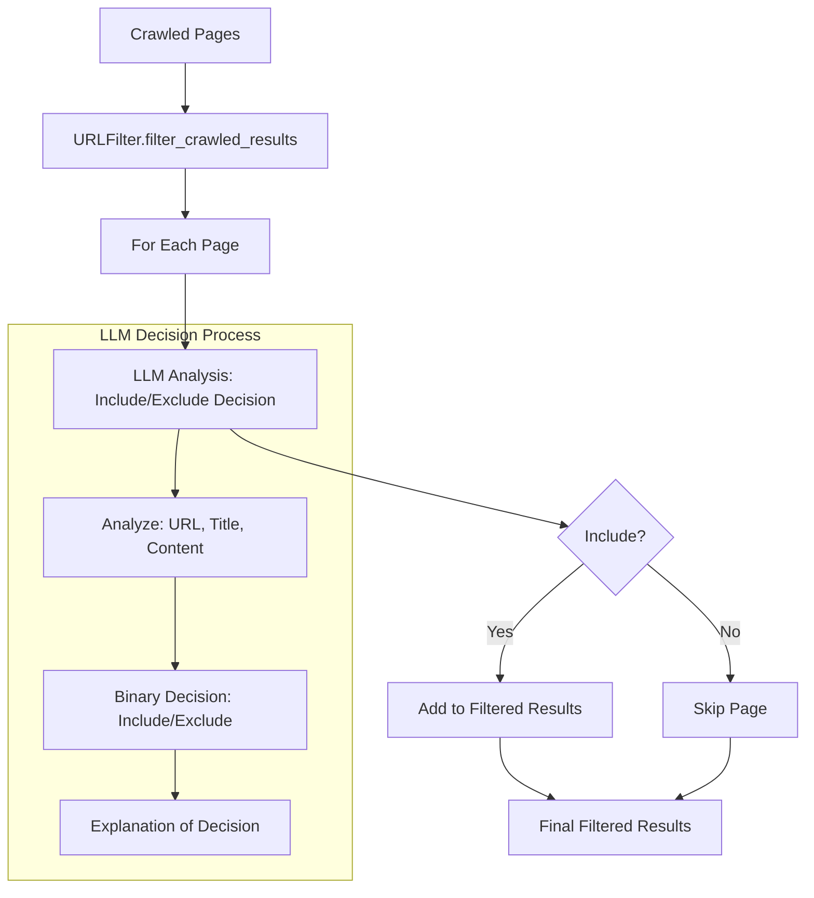

# Binary URL Filtering Implementation Plan

**Date**: 2025-05-25  
**Objective**: Change URL filtering from relevancy scores (0.0-1.0) to direct binary include/exclude decisions

## Current System Analysis

The existing URL filtering system:
- Uses LLM to analyze page content and assign relevancy scores (0.0-1.0)
- Applies a configurable threshold (default 0.7) to determine inclusion
- Stores relevance metadata (score + explanation) with results
- Provides detailed scoring feedback during filtering process

## Proposed Architecture



## Implementation Phases

### Phase 1: Update URLFilter Class (`src/url_filter.py`)

**Key Changes:**
1. **Remove relevance scoring logic**
   - Remove `relevance_threshold` parameter from `filter_crawled_results()`
   - Update `_analyze_page_relevance()` to return `(bool, str)` instead of `(float, str)`
   - Simplify method name to `_analyze_page_inclusion()`

2. **Update LLM prompt structure**
   - Change from requesting 0.0-1.0 scores to direct include/exclude decision
   - Maintain explanation requirement for transparency
   - Simplify response parsing logic

3. **Update result metadata**
   - Replace `relevance_score` with `included` boolean
   - Rename `relevance_explanation` to `decision_explanation`

**New Method Signatures:**
```python
async def filter_crawled_results(self, crawled_results: List[Dict[str, Any]]) -> List[Dict[str, Any]]
async def _analyze_page_inclusion(self, page_result: Dict[str, Any]) -> Tuple[bool, str]
```

**New LLM Prompt:**
```
Analyze this web page and decide whether to INCLUDE or EXCLUDE it for the target topic: "{target_topic}"

Page Details:
- URL: {url}
- Title: {title}  
- Content Sample: {content_sample}

Make a binary decision based on relevance to the target topic.

Respond in this exact JSON format:
{
    "decision": "include" or "exclude",
    "explanation": "Brief explanation of why this page should be included or excluded"
}

Consider factors like:
- Does the content directly address the target topic?
- Are there specific technical details related to the target?
- Is this a navigation page vs. actual documentation content?
- Does the URL path indicate relevance?
```

**New Result Metadata:**
```python
# Before
result['relevance_score'] = 0.85
result['relevance_explanation'] = "Highly relevant to Python SDK"

# After
result['included'] = True
result['decision_explanation'] = "Contains Python SDK documentation"
```

### Phase 2: Update ApiDocCrawler Integration (`src/api_doc_crawler.py`)

**Key Changes:**
1. **Remove threshold parameters**
   - Remove `relevance_threshold` from `crawl_and_parse()` and `crawl_only()`
   - Update method signatures and documentation

2. **Update result handling**
   - Modify metadata handling for binary decisions
   - Update `save_results()` to reflect new decision format

**Updated Method Signatures:**
```python
async def crawl_and_parse(self, url: str) -> List[Dict[str, Any]]
async def crawl_only(self, url: str) -> List[Dict[str, Any]]
```

### Phase 3: Update Command-Line Interface (`src/main.py`)

**Key Changes:**
1. **Remove threshold argument**
   - Remove `--relevance-threshold` command-line option
   - Update help text and documentation
   - Simplify main function signature

**Updated Function Signature:**
```python
async def main(url: str, output_dir: str = "output", keywords: Optional[str] = None,
               max_depth: int = 2, max_pages: int = 25, include_external: bool = False,
               target_topic: Optional[str] = None) -> None
```

### Phase 4: Update Configuration and Documentation

**Key Changes:**
1. **Update method documentation** throughout codebase
2. **Update README.md** with new binary filtering approach
3. **Update example scripts** to reflect new interface
4. **Update test files** for binary decision testing

## Benefits of Binary Approach

1. **Simplified Decision Making**: No arbitrary threshold values to configure
2. **Clearer User Experience**: Binary include/exclude is more intuitive than numeric scores
3. **Reduced Complexity**: Eliminates scoring logic and threshold management
4. **Better LLM Performance**: Binary decisions may be more reliable than precise scoring
5. **Maintained Transparency**: Still provides explanations for decisions
6. **Cost Efficiency**: Simpler prompts may reduce token usage

## Breaking Changes and Migration

**Breaking Changes:**
- `--relevance-threshold` command-line argument removed
- `relevance_threshold` parameter removed from API methods
- Result metadata structure changed (score → boolean)

**Migration Guide for Users:**
```bash
# Before
python -m src.main https://example.com --target-topic "Python SDK" --relevance-threshold 0.8

# After  
python -m src.main https://example.com --target-topic "Python SDK"
```

## Testing Strategy

1. **Unit Tests**: Update URLFilter tests for binary decisions
2. **Integration Tests**: Test full crawler pipeline with new filtering
3. **Comparison Testing**: Compare results between old scoring and new binary approach
4. **Performance Testing**: Measure token usage and response time differences

## Implementation Order

1. **Start with URLFilter class** - Core logic changes
2. **Update ApiDocCrawler** - Integration layer changes  
3. **Update command-line interface** - User interface changes
4. **Update documentation and tests** - Supporting materials

## Success Criteria

- [ ] URLFilter makes binary include/exclude decisions
- [ ] No relevance scores in codebase or output
- [ ] Command-line interface simplified (no threshold parameter)
- [ ] All existing functionality preserved except scoring
- [ ] Clear explanations still provided for decisions
- [ ] Documentation updated to reflect changes
- [ ] Tests pass with new binary approach

## Risk Mitigation

- **Decision Quality**: Test extensively to ensure binary decisions are as effective as scored decisions
- **User Adoption**: Provide clear migration documentation
- **Backward Compatibility**: Consider versioning if needed for enterprise users