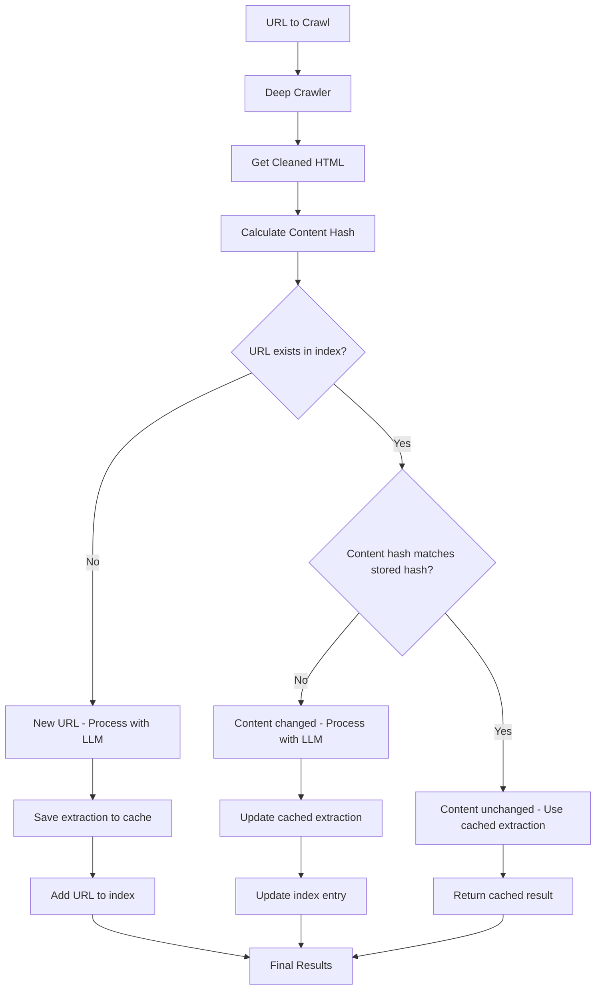

# Content-Based Deduplication System Implementation Plan

**Date**: 2025-05-26  
**Purpose**: Implement a smart caching system to avoid redundant LLM processing by tracking content changes via hash comparison

## Problem Statement

The current crawler processes every page through expensive LLM extraction, even if the content hasn't changed since the last crawl. This wastes API costs and processing time when re-crawling the same documentation sites.

## Solution Overview

Implement a content-based deduplication system that:
1. Stores cleaned HTML content hashes for each processed URL
2. Compares new content against stored hashes before LLM processing
3. Only processes content through LLM when it has actually changed
4. Maintains an extraction cache in `extracted-docs/` directory

## Corrected Logic Flow



## Architecture Components

### 1. Content Index Manager (`src/content_index.py`)

**Purpose**: Manage the content hash index and extraction cache

**Key Methods**:
- `load_index()` - Load existing content index from file
- `save_index()` - Save content index to file
- `get_url_record(url)` - Get stored record for URL (returns None if not found)
- `calculate_content_hash(cleaned_html)` - Calculate SHA-256 hash of cleaned HTML
- `is_content_changed(url, new_hash)` - Check if content has changed for URL
- `update_url_record(url, hash, extraction_data, metadata)` - Update/add URL record
- `get_cached_extraction(url)` - Retrieve cached LLM extraction result

### 2. Enhanced ApiDocCrawler (`src/api_doc_crawler.py`)

**New Logic Integration**:
- Initialize ContentIndexManager in constructor
- Check content hashes before LLM processing in `crawl_and_parse()`
- Skip LLM calls for unchanged content
- Update index with new extractions
- Maintain full backward compatibility

**Modified Methods**:
- `crawl_and_parse()` - Add hash checking and cache logic
- `save_results()` - Update to work with cached and new results

### 3. Directory Structure

```
extracted-docs/
├── content_index.json          # Main index mapping URLs to hashes and metadata
├── extractions/               # Cached LLM extraction results
│   ├── {url_hash_1}.json     # Extraction data for URL 1
│   ├── {url_hash_2}.json     # Extraction data for URL 2
│   └── ...
└── metadata/                  # Page metadata cache
    ├── {url_hash_1}_meta.json # Metadata for URL 1
    ├── {url_hash_2}_meta.json # Metadata for URL 2
    └── ...
```

### 4. Index Schema

**Main Index (`content_index.json`)**:
```json
{
  "https://example.com/page1": {
    "content_hash": "sha256_hash_of_cleaned_html",
    "last_extracted": "2025-05-26T17:00:00Z",
    "extraction_file": "extractions/abc123def.json",
    "metadata_file": "metadata/abc123def_meta.json",
    "url_hash": "abc123def"
  },
  "https://example.com/page2": {
    "content_hash": "sha256_hash_of_cleaned_html_2",
    "last_extracted": "2025-05-26T17:15:00Z",
    "extraction_file": "extractions/def456ghi.json",
    "metadata_file": "metadata/def456ghi_meta.json",
    "url_hash": "def456ghi"
  }
}
```

**Extraction File (`extractions/{url_hash}.json`)**:
```json
{
  "url": "https://example.com/page1",
  "content": ["Extracted content line 1", "Extracted content line 2"],
  "extraction_timestamp": "2025-05-26T17:00:00Z"
}
```

**Metadata File (`metadata/{url_hash}_meta.json`)**:
```json
{
  "url": "https://example.com/page1",
  "title": "Page Title",
  "depth": 1,
  "included": true,
  "decision_explanation": "Relevant to Python SDK documentation",
  "crawl_timestamp": "2025-05-26T16:59:00Z"
}
```

## Implementation Workflow

### Current Flow:
1. Crawl URL → Get HTML → Parse with LLM → Save Results

### New Flow:
1. Crawl URL → Get Cleaned HTML → Calculate Hash
2. Check if URL exists in content index
3. **If URL not in index**: Process with LLM → Save extraction → Add to index
4. **If URL in index**: Compare hashes
   - **If hashes match**: Return cached extraction (skip LLM)
   - **If hashes differ**: Process with LLM → Update cached extraction → Update index

## Benefits

1. **Cost Reduction**: Eliminate redundant LLM API calls for unchanged content
2. **Performance**: Faster processing for previously crawled content
3. **Efficiency**: Only process content that has actually changed
4. **Incremental Updates**: Support for updating only changed pages in large documentation sites
5. **Transparency**: Clear tracking of what has been processed and when

## Implementation Phases

### Phase 1: Core Infrastructure
- [ ] Create `ContentIndexManager` class with hash calculation
- [ ] Implement index file I/O operations
- [ ] Create directory structure in `extracted-docs/`
- [ ] Add comprehensive error handling

### Phase 2: Integration with ApiDocCrawler
- [ ] Modify `crawl_and_parse()` method to use content index
- [ ] Add hash checking before LLM processing
- [ ] Implement cache retrieval and update logic
- [ ] Ensure backward compatibility

### Phase 3: Enhanced Features
- [ ] Add command-line options for cache management
- [ ] Implement cache statistics and reporting
- [ ] Add manual cache invalidation utilities
- [ ] Create cache cleanup tools

### Phase 4: Testing & Validation
- [ ] Create comprehensive test suite
- [ ] Test hash collision scenarios (extremely unlikely but good practice)
- [ ] Validate incremental update workflows
- [ ] Performance benchmarking

## Technical Considerations

### Hash Algorithm
- **Choice**: SHA-256 for content hashing
- **Rationale**: Good balance of speed and collision resistance
- **Input**: Cleaned HTML content (not raw HTML)

### File Naming
- **URL Hash**: Use first 12 characters of SHA-256 hash of URL for file naming
- **Collision Handling**: Append counter if hash collision occurs (extremely rare)

### Error Handling
- **Index Corruption**: Rebuild index from existing extraction files
- **Missing Files**: Remove stale entries from index
- **Hash Mismatches**: Log warnings and re-process content

### Performance Optimizations
- **Lazy Loading**: Only load index when needed
- **Batch Updates**: Group index updates for better I/O performance
- **Memory Management**: Clear large content from memory after hashing

## Migration Strategy

### For Existing Users
1. **Backward Compatibility**: System works without existing cache
2. **Gradual Migration**: Existing `output/` directory remains unchanged
3. **Opt-in**: Cache system activates automatically but doesn't break existing workflows

### First Run
1. All URLs will be processed normally (no cache exists)
2. Index and cache files will be created
3. Subsequent runs will benefit from caching

## Success Metrics

1. **Cost Reduction**: Measure LLM API call reduction on re-crawls
2. **Performance**: Measure time savings for unchanged content
3. **Accuracy**: Verify content change detection works correctly
4. **Reliability**: Ensure system handles edge cases gracefully

## Future Enhancements

1. **Cache Expiration**: Add time-based cache invalidation
2. **Selective Refresh**: Allow manual refresh of specific URLs
3. **Cache Analytics**: Detailed reporting on cache hit/miss rates
4. **Distributed Caching**: Support for shared cache across multiple instances