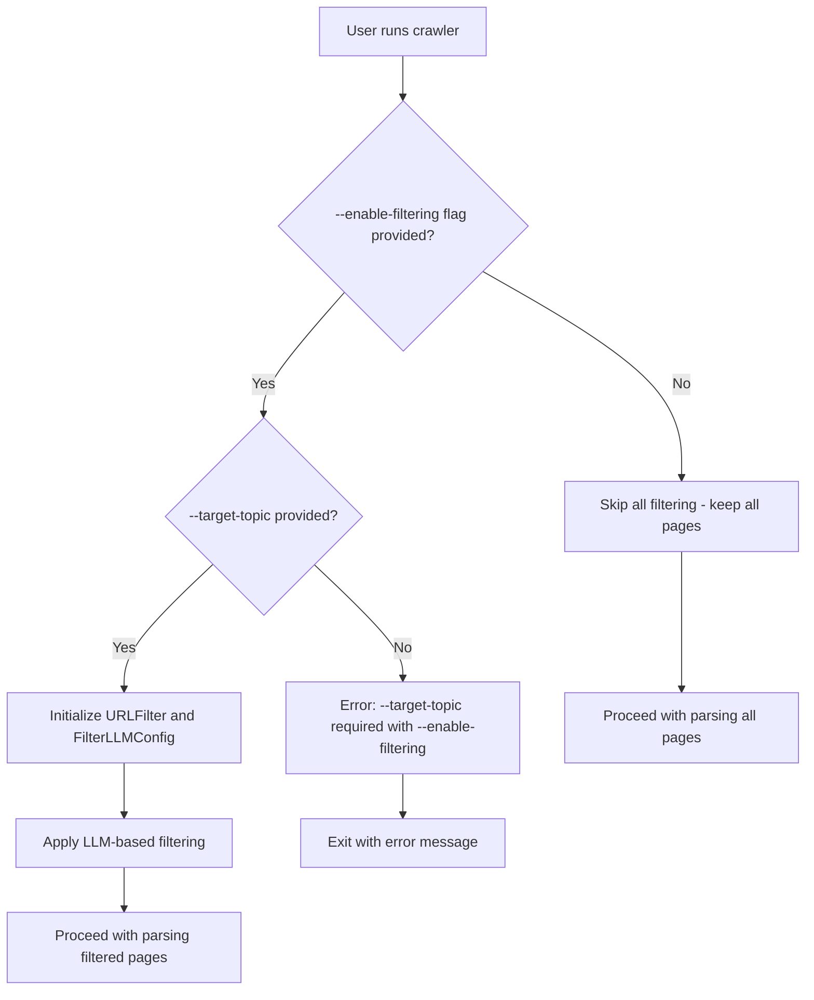

# Filtering Opt-In Implementation Plan

**Date**: 2025-05-26  
**Objective**: Make LLM-based page filtering opt-in rather than automatic when target topic is provided

## Current State Analysis

### Current Behavior
- Filtering is automatically enabled whenever a `target_topic` is provided via `--target-topic` flag
- All pages are processed through LLM-based binary filtering when target topic exists
- FilterLLMConfig is always initialized when target topic is specified
- Users cannot easily disable filtering without removing the target topic

### Issues with Current Approach
1. **Automatic LLM Usage**: Users may want to specify a target topic for documentation purposes without triggering expensive LLM filtering
2. **Performance Impact**: Unnecessary LLM API calls when filtering isn't desired
3. **Cost Implications**: Filter LLM costs are incurred even when user just wants to crawl everything
4. **Lack of Explicit Control**: No clear way to disable filtering while keeping target topic

## Desired Behavior

### New Opt-In Model
- Filtering should only be enabled when both `--enable-filtering` flag AND `--target-topic` are provided together
- Default behavior: Keep all crawled pages (no filtering)
- Explicit user intent required for LLM-based filtering

### Command-Line Interface
```bash
# No filtering - keep all pages (new default)
python -m src.main https://example.com/docs

# Enable filtering with target topic (new requirement)
python -m src.main https://example.com/docs --enable-filtering --target-topic "Python SDK documentation"

# Error case - filtering flag without target topic
python -m src.main https://example.com/docs --enable-filtering
# Should show: Error: --target-topic is required when --enable-filtering is used
```

## Implementation Plan

### Phase 1: Command-Line Interface Updates (`src/main.py`)

#### Changes Required
1. **Add New Argument**:
   ```python
   parser.add_argument("--enable-filtering", action="store_true", 
                      help="Enable LLM-based filtering (requires --target-topic)")
   ```

2. **Add Validation Logic**:
   ```python
   # Validate flag combination
   if args.enable_filtering and not args.target_topic:
       parser.error("--target-topic is required when --enable-filtering is used")
   ```

3. **Update Main Function Signature**:
   ```python
   async def main(url: str, output_dir: str = "output", keywords: Optional[str] = None,
                  max_depth: int = 2, max_pages: int = 25, include_external: bool = False,
                  target_topic: Optional[str] = None, enable_filtering: bool = False) -> None:
   ```

4. **Modify FilterLLMConfig Creation**:
   ```python
   # Only create filter config when filtering is explicitly enabled
   filter_llm_config = None
   if enable_filtering and target_topic:
       filter_llm_config = FilterLLMConfig()
   ```

### Phase 2: ApiDocCrawler Class Updates (`src/api_doc_crawler.py`)

#### Changes Required
1. **Update Constructor**:
   ```python
   def __init__(self, crawler_config: Optional[CrawlerConfig] = None,
                llm_config: Optional[LLMConfig] = None,
                filter_llm_config: Optional[FilterLLMConfig] = None,
                target_topic: str = "",
                filtering_enabled: bool = False):  # New parameter
   ```

2. **Modify Filtering Logic**:
   ```python
   # In crawl_and_parse method
   if self.filtering_enabled and self.target_topic and self.filter_llm_config:
       print(f"Filtering for inclusion based on: {self.target_topic}")
       crawler_results = await self.url_filter.filter_crawled_results(crawler_results)
   else:
       print("Filtering disabled - keeping all crawled pages")
   ```

3. **Update URLFilter Initialization**:
   ```python
   # Only initialize URLFilter when filtering is enabled
   if filtering_enabled and filter_llm_config:
       self.url_filter = URLFilter(filter_llm_config, target_topic)
   else:
       self.url_filter = None
   ```

### Phase 3: Conditional Filtering Logic

#### URLFilter Integration
1. **Safe Filter Calls**:
   ```python
   # Check if filtering is enabled before calling filter methods
   if self.url_filter and self.filtering_enabled:
       crawler_results = await self.url_filter.filter_crawled_results(crawler_results)
   ```

2. **Graceful Degradation**:
   ```python
   # Handle cases where filtering is disabled
   if not self.filtering_enabled:
       print("No filtering applied - all pages included")
       return crawler_results  # Return all results unchanged
   ```

### Phase 4: Error Handling and Validation

#### FilterLLMConfig Validation
1. **Conditional Validation**:
   ```python
   # Only validate FilterLLMConfig when filtering is enabled
   if filtering_enabled and filter_llm_config:
       filter_llm_config.validate()
   ```

2. **Clear Error Messages**:
   ```python
   if enable_filtering and not target_topic:
       raise ValueError("Target topic is required when filtering is enabled")
   ```

### Phase 5: Documentation and Help Updates

#### Command-Line Help Text
```python
parser.add_argument("--enable-filtering", action="store_true", 
                   help="Enable LLM-based page filtering for relevance (must be used with --target-topic)")
parser.add_argument("--target-topic", 
                   help="Target topic for filtering when --enable-filtering is used (e.g., 'Python SDK documentation')")
```

#### Usage Examples
```bash
# Basic crawling without filtering (default)
python -m src.main https://docs.example.com/api

# Crawling with LLM-based filtering
python -m src.main https://docs.example.com/api --enable-filtering --target-topic "Python SDK documentation"

# Advanced crawling with filtering and custom settings
python -m src.main https://docs.example.com/api \
  --enable-filtering \
  --target-topic "REST API endpoints" \
  --max-depth 3 \
  --max-pages 50
```

## Implementation Flow Diagram



## Benefits of This Implementation

### 1. **Explicit User Control**
- Users must explicitly opt-in to filtering
- Clear intention required for LLM usage
- No surprise API costs

### 2. **Performance Optimization**
- No unnecessary LLM calls when filtering isn't needed
- Faster crawling for users who want everything
- Reduced API latency

### 3. **Cost Management**
- Filter LLM API costs only when explicitly requested
- Users can control their API usage
- Predictable cost structure

### 4. **Backward Compatibility**
- Existing programmatic usage continues to work
- Default behavior is safe (no filtering)
- Gradual migration path for existing users

### 5. **Clear Intent**
- Command-line usage makes filtering intention explicit
- Self-documenting behavior
- Reduced user confusion

## Testing Strategy

### Test Cases
1. **Default Behavior**: Crawling without any filtering flags should keep all pages
2. **Filtering Enabled**: Using both flags should enable filtering
3. **Error Case**: Using `--enable-filtering` without `--target-topic` should show error
4. **Backward Compatibility**: Programmatic usage should continue working
5. **Performance**: Verify no LLM calls when filtering is disabled

### Validation Points
- Command-line argument parsing
- FilterLLMConfig initialization only when needed
- URLFilter creation conditional on flags
- Error messages are clear and helpful
- All existing functionality preserved

## Migration Notes

### For Existing Users
- **Breaking Change**: Users currently relying on automatic filtering when `--target-topic` is provided will need to add `--enable-filtering` flag
- **Migration Path**: Update existing scripts to include `--enable-filtering` flag
- **Benefit**: Explicit control over filtering behavior

### For New Users
- **Simpler Default**: Basic crawling works without complex configuration
- **Clear Options**: Filtering is opt-in with clear requirements
- **Better Performance**: Default behavior is optimized for speed

## Implementation Timeline

1. **Phase 1**: Command-line interface updates (30 minutes)
2. **Phase 2**: ApiDocCrawler class modifications (45 minutes)
3. **Phase 3**: Conditional filtering logic (30 minutes)
4. **Phase 4**: Error handling and validation (20 minutes)
5. **Phase 5**: Documentation updates (15 minutes)

**Total Estimated Time**: ~2.5 hours

## Success Criteria

- [ ] Default crawling keeps all pages without filtering
- [ ] `--enable-filtering` flag requires `--target-topic` to work
- [ ] Using `--enable-filtering` without `--target-topic` shows clear error
- [ ] Filtering works correctly when both flags are provided
- [ ] No FilterLLMConfig validation when filtering is disabled
- [ ] Backward compatibility maintained for programmatic usage
- [ ] Performance improved for non-filtering use cases
- [ ] Clear help text and documentation updated