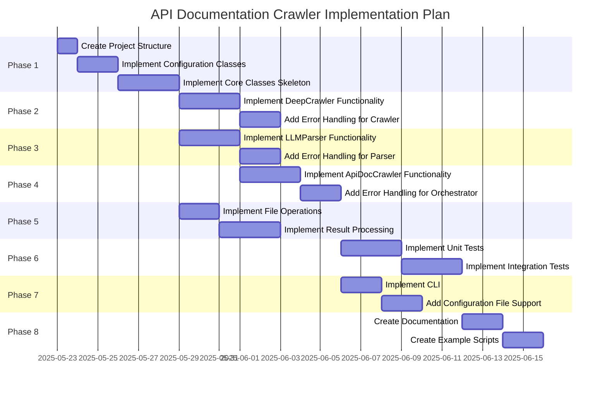

# Implementation Plan

This file outlines the detailed implementation plan for the API documentation crawler project.
2025-05-22 21:48:00 - Initial implementation plan creation.

*

## Phase 1: Core Structure Setup (High Priority)

1. **Create Project Structure** (Priority: High)
   - Create `src` directory for source code
   - Create `tests` directory for test files
   - Create `config` directory for configuration files
   - Create `output` directory for crawled results

2. **Implement Configuration Classes** (Priority: High)
   - Implement `CrawlerConfig` class with essential parameters
   - Implement `LLMConfig` class with provider, temperature, and generic instruction
   - Add validation for configuration parameters

3. **Implement Core Classes Skeleton** (Priority: High)
   - Implement `DeepCrawler` class with basic structure
   - Implement `LLMParser` class with basic structure
   - Implement `ApiDocCrawler` class with basic structure
   - Define clear interfaces between classes

## Phase 2: Deep Crawler Implementation (High Priority)

4. **Implement DeepCrawler Functionality** (Priority: High)
   - Implement crawler initialization with configuration
   - Implement URL crawling using BestFirstCrawlingStrategy
   - Add support for keyword-based relevance scoring
   - Implement result collection and processing

5. **Add Error Handling for Crawler** (Priority: Medium)
   - Implement error handling for network issues
   - Add retry logic for failed requests
   - Implement logging for crawler operations
   - Add validation for crawler inputs

## Phase 3: LLM Parser Implementation (High Priority)

6. **Implement LLMParser Functionality** (Priority: High)
   - Implement parser initialization with configuration
   - Implement HTML content parsing using LLMContentFilter
   - Add support for the generic instruction
   - Implement result formatting and processing

7. **Add Error Handling for Parser** (Priority: Medium)
   - Implement error handling for LLM API issues
   - Add fallback mechanisms for parsing failures
   - Implement logging for parser operations
   - Add validation for parser inputs

## Phase 4: High-Level Orchestration (Medium Priority)

8. **Implement ApiDocCrawler Functionality** (Priority: Medium)
   - Implement orchestrator initialization with configurations
   - Implement crawl_and_parse method to coordinate operations
   - Add support for saving results to files
   - Implement progress tracking and reporting

9. **Add Error Handling for Orchestrator** (Priority: Medium)
   - Implement error handling for coordination issues
   - Add recovery mechanisms for partial failures
   - Implement comprehensive logging
   - Add validation for orchestrator inputs

## Phase 5: Utility Functions (Medium Priority)

10. **Implement File Operations** (Priority: Medium)
    - Implement functions to save content to markdown files
    - Implement functions to save content to JSON files
    - Add support for creating directory structures
    - Implement file naming conventions

11. **Implement Result Processing** (Priority: Medium)
    - Implement functions to format crawler results
    - Implement functions to format parser results
    - Add support for combining results from multiple pages
    - Implement metadata extraction and processing

## Phase 6: Testing and Validation (High Priority)

12. **Implement Unit Tests** (Priority: High)
    - Create unit tests for CrawlerConfig and LLMConfig
    - Create unit tests for DeepCrawler
    - Create unit tests for LLMParser
    - Create unit tests for ApiDocCrawler

13. **Implement Integration Tests** (Priority: Medium)
    - Create integration tests for crawler and parser interaction
    - Create integration tests for orchestrator and components
    - Add tests for error handling and recovery
    - Implement test fixtures and mocks

## Phase 7: Command-Line Interface (Low Priority)

14. **Implement CLI** (Priority: Low)
    - Create command-line interface for the crawler
    - Add support for configuration via command-line arguments
    - Implement progress reporting to the console
    - Add help and documentation

15. **Add Configuration File Support** (Priority: Low)
    - Implement support for configuration files
    - Add validation for configuration files
    - Implement default configuration values
    - Add support for environment variables

## Phase 8: Documentation and Examples (Medium Priority)

16. **Create Documentation** (Priority: Medium)
    - Create README.md with project overview
    - Create API documentation for all classes
    - Add usage examples
    - Document configuration options

17. **Create Example Scripts** (Priority: Medium)
    - Create example for crawling Python documentation
    - Create example for crawling JavaScript documentation
    - Create example for crawling REST API documentation
    - Add comments and explanations

## Implementation Timeline and Dependencies

## Task Prioritization Matrix

| Task | Impact | Effort | Priority |
|------|--------|--------|----------|
| Create Project Structure | High | Low | High |
| Implement Configuration Classes | High | Medium | High |
| Implement Core Classes Skeleton | High | Medium | High |
| Implement DeepCrawler Functionality | High | High | High |
| Implement LLMParser Functionality | High | High | High |
| Implement ApiDocCrawler Functionality | High | Medium | Medium |
| Add Error Handling | Medium | Medium | Medium |
| Implement File Operations | Medium | Low | Medium |
| Implement Result Processing | Medium | Medium | Medium |
| Implement Unit Tests | High | Medium | High |
| Implement Integration Tests | Medium | Medium | Medium |
| Implement CLI | Low | Low | Low |
| Add Configuration File Support | Low | Low | Low |
| Create Documentation | Medium | Medium | Medium |
| Create Example Scripts | Medium | Low | Medium |

## Key Milestones

1. **Core Structure Complete** - End of Phase 1
2. **Crawler Component Working** - End of Phase 2
3. **Parser Component Working** - End of Phase 3
4. **Full Pipeline Working** - End of Phase 4
5. **Utility Functions Complete** - End of Phase 5
6. **Testing Complete** - End of Phase 6
7. **User Interface Complete** - End of Phase 7
8. **Documentation Complete** - End of Phase 8

## Risk Assessment and Mitigation

| Risk | Impact | Probability | Mitigation |
|------|--------|------------|------------|
| LLM API rate limiting | High | Medium | Implement caching and rate limiting |
| Complex HTML structures | Medium | High | Test with various documentation sites |
| Large documentation sites | High | Medium | Implement pagination and chunking |
| API changes in crawl4ai | High | Low | Pin dependency versions |
| Performance issues | Medium | Medium | Implement performance monitoring |